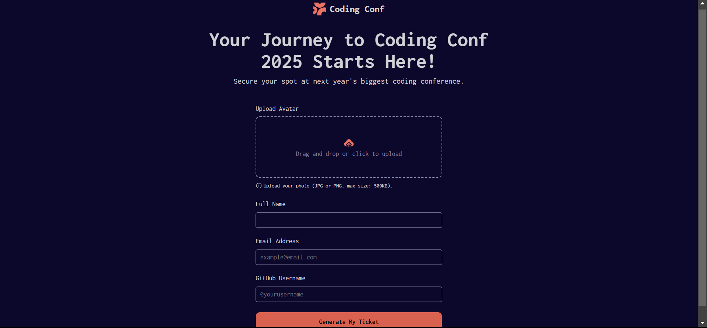

# Frontend Mentor - Conference ticket generator solution

This is a solution to the [Conference ticket generator challenge on Frontend Mentor](https://www.frontendmentor.io/challenges/conference-ticket-generator-oq5gFIU12w). Frontend Mentor challenges help you improve your coding skills by building realistic projects. 

## Table of contents

- [Overview](#overview)
  - [The challenge](#the-challenge)
  - [Screenshot](#screenshot)
  - [Links](#links)
- [My process](#my-process)
  - [Built with](#built-with)
  - [What I learned](#what-i-learned)
  - [Continued development](#continued-development)
- [Author](#author)


## Overview

### The challenge

Users should be able to:

- Complete the form with their details
- Receive form validation messages if:
  - Any field is missed
  - The email address is not formatted correctly
  - The avatar upload is too big or the wrong image format
- Complete the form only using their keyboard
- Have inputs, form field hints, and error messages announced on their screen reader
- See the generated conference ticket when they successfully submit the form
- View the optimal layout for the interface depending on their device's screen size
- See hover and focus states for all interactive elements on the page

### Screenshot




### Links

- Solution URL: [Add solution URL here](https://your-solution-url.com)
- Live Site URL: [Add live site URL here](https://your-live-site-url.com)

## My process

-For this project, I decided to start coding considering large screen sizes then I used media queries for smaller screen sizes.

This time, I structred my html document in a better way so I did not face any difficulties in terms of design and layout, especially when targeting small devices, that was relatively easy compared to previous projects.
Anyway, at the moment of typing this, I finished the form page, made it responsive, and functional. However, for some reason, my JavaScript handles the drag and drop, in addition to remove and change buttons in a weird way, but since this is my first time writing JavaScript in what seems to be a real-world scenario, I don't really have a problem with it, as long as it works correctly.

  - I started structuring my html this way: 
  ```html
    <main>
      <header>
        <div class="header-container">
          ...
        </div>     
      </header>
      <div class="hero">
        <div class="hero-container">
          ...
        </div>
      </div>

      <form action="" method="post">
      ...
      </form>

      <script>
        ...
      </script>
    </main>
  ```
  - I did the usual with the stylesheet, set the css variables and removed the default margins and paddings:
  ```css
    *, 
    *::after,
    *::before {
      box-sizing: border-box;
      margin: 0;
      padding: 0;
    }

    :root {
      --Neutral-0: hsl(0, 0%, 100%);
      --Neutral-300: hsl(252, 6%, 83%);
      --Neutral-500: hsl(245, 15%, 58%);
      --Neutral-700: hsl(245, 19%, 35%);
      --Neutral-900: hsl(248, 70%, 10%);
      --Orange-500: hsl(7, 88%, 67%);
      --Orange-700: hsl(7, 71%, 60%);
      --Gradient: hsl(7, 86%, 67%), hsl(0, 0%, 100%);
      --font-bold: 'FontBold';
      --font-extraBold: 'FontExtraBold';
      --font-medium: 'FontMedium';
      --font-regular: 'FontRegular';
    }
  ```
As for the script, for now, it handles the upload area, where I set the display of the input button to none and made the div `<div class="upload-area sm-text" id="uploadArea">` functional (users can drag and drop or click on this area to upload a photo). Here's the script:
- I first targeted the upload area and the input button (id of `fileInput`): 
```js
    const uploadArea = document.getElementById("uploadArea");
    const fileInput = document.getElementbyId("fileInput");
    uploadArea.addEventListener("click", () => {
      fileInput.click();
    })

    uploadArea.addEventListener('dragover', (e) => {
      e.preventDefault();
      uploadArea.classList.add('dragover');
    })

    uploadArea.addEventListener("dragleave", () => {
      uploadArea.classList.remove("dragover");
    })

    uploadArea.addEventListener("drop", (e) => {
      e.preventDefault();
      uploadArea.classList.remove('dragover');
      const file = e.dataTransfer.files[0];
    })
```
- You can see that I added a class named `dragover` which styles the upload area whenever the user drags a file to it, and once it is dropped, the `dragover` class is removed and then the photo is stored in a variable named file, `const file = e.dataTransfer.files[0]` where `e` is the event object returned by the browser that basically holds information (or data) about the action performed (hence the event), typically by the user, such as the `dataTransfer` object which has an array property `files` which as far as I know stores the files uploaded by the user, as you can see, I'm accessing the file at index 0, which is the uploaded photo.
```js
  if (file) {
    handleFile(file);
  }
```
`handleFile()` is a function that performs the reading and uploading of the file: 
```js
  const handleFile = (file) => {
    const fileSizeLimit = 500 * 1024;
    if(file.size > fileSizeLimit) {
      alert("File size exceeds 500KB.");
      fileInput.value = "";
      return;
    }

    const reader = new FileReader();
    reader.onload = (e) => {
      preview.src = e.target.result;
      preview.style.display = "block";
    };
    reader.readAsDataURL(file);

    removeBtn.style.display = "inline-block";
    changeBtn.style.display = "inline-block";
    uploadText.style.display = "none";
  }
```
I then decided to create a separate JavaScript file and move the script code to that file.

I thought I should handle the congrats page separately as well, but as the code became messy, I stepped back and included the second page within the main index.html file.

In the script file, I fixed some issues I ran into initially, one of which was that whenever the user removes an image, it retriggers the click button and it opens the user's file explorer again, the reason for that was that I did not stop propagation, so I did: 
```js
  removeBtn.addEventListener("click", (e) => {
    e.preventDefault();
    e.stopPropagation();
    ...
})
```
`e.stopPropagation()` prevents the event from triggering event listeners attached to parent elements (in this case, `uploadArea.addEventListener("click", () => {fileInput.click();})`). 

This is how I handled the validation of file type:
```js
    const fileSizeLimit = 500 * 1024;
    const validTypes = ['image/jpeg', 'image/png'];

    if(file.size > fileSizeLimit) {
        alert("File size exceeds 500KB.");
        fileInput.value = "";
        return;
    }else if (!validTypes.includes(file.type)) {
        alert("File type not supported. Upload a png or jpeg");
        fileInput.value = "";
        return;
    }
``` 

When I got to the part when the user clicks the submit button, I realized I should've taken a slightly different approach to validating the file type and inputs, I wrote separate functions for both: 

```js
  const validateFileType = () => {
    const file = fileInput.files[0];
    if (!file) return false;
    
    const fileSizeLimit = 500 * 1024;
    const validTypes = ['image/jpeg', 'image/png'];
    let isValid = true;

    if(file.size > fileSizeLimit) {
        alert("File size exceeds 500KB.");
        fileInput.value = "";
        isValid = false;
    } else if (!validTypes.includes(file.type)) {
        alert("File type not supported. Upload a png or jpeg");
        fileInput.value = "";
        isValid = false;
    }
    return isValid;
  }

  const validateTextInputs = () => {
    let isValid = true;

    textInputs.forEach((input) => {
        if (input.value.trim() === "") {
            alert("Invalid or empty input");
            isValid = false;
        } else {
            isValid = true;
        }
    })
    return isValid
  }
```


### Built with

- Semantic HTML5 markup
- CSS custom properties
- JavaScript
- Flexbox


### What I learned

I learned about `FileReader()` API in JavaScript, which is a built-in object used to read the content of files in different formats (text, data URLs, or binary data), and to process the file data before displaying or uploading it. 
I learned three of its properties:
  1- `FileReader.result`: contains the result of the file read operation, and its type depends on the method used (`readAsText`, `readAsDataURL`, etc.)
  2- `FileReader.readyState`: represents the state of the reader.
                                - `0` (EMPTY): No data loaded yet.
                                - `1` (LOADING): Data is currently being read.
                                - `2` (DONE): Reading operation completed. 
  3- `FileReader.error`: contains any error that occured during the read operation.

Along with three other methods:
  1- `readAsText(file)`: reads the file as plain text, reading `.txt` files for example.
  2- `readAsDataURL(file)`: reads the file as a base64-encoded string (used for embedding images or other media directly in HTML). And this is the method I used to read the uploaded photo.
  3- `abort()`: cancels the current read operation.

And some events:
  1- `onload`: triggered when the read operation successfully completes.
  2- `onerror`: triggered if an error occured during the read operation.
  3- `onprogress`: triggered periodically while the read operation is in progress (useful for showing a loading bar).
  4- `onabort`: triggered when the `abort()` method is called.

Real-Life Applications: 
  1- **Image Previews**: allow users to see the image they're uploading before submission.
  2- **File Validation**: Read and check the file's content.
  3- **Drag-and-Drop File Upload**: Process files uploaded via drag-and-drop.
  


### Continued development

Writing JavaScript code was not that easy, but I learned a ton of stuff doing so, like the `FileReader()` api and some approaches to validation (writing separate functions for file type and inputs validation). I also successfully fixed the issue of re-triggering events using `e.stopPropagation()`

## Author

- Frontend Mentor - [@ziad-rima](https://www.frontendmentor.io/profile/ziad-rima)
- LinkedIn - [Ziad (Wassim) Rima](https://www.linkedin.com/in/ziad-rima-97b6b72b2/)
